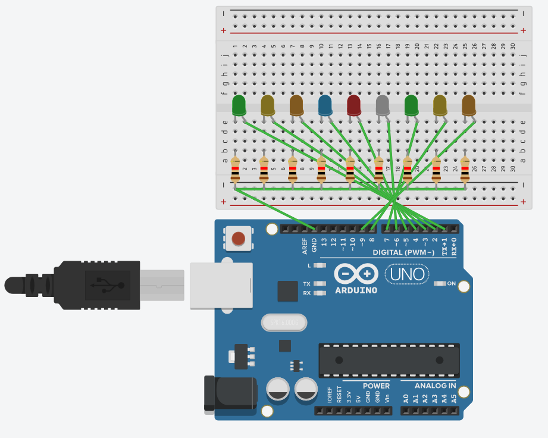
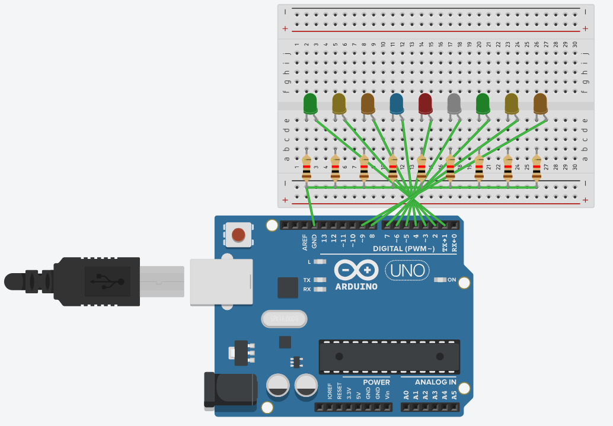

# lista1-ex-Arduino
lista de exercícios de arduino simples de só piscar leds
  

  <h3>6 leds piscando de 1 em 1</h3>
   
  

  

  <h3>6 leds piscando de 2 em 2</h3>
   
  

  

  <h3>9 leds piscando de 3 em 3 e depois 1 por 1</h3>
   
  

  

  <h3>9 leds piscando em ordem descrescente com intervalos de 50 milisegundos</h3>
   
  

  

  <h3>9 leds piscando em ordem crescente</h3>
   
  

  

  <h3>9 leds piscando total</h3>
   
  

  

  <h3>10 leds piscando em ordem crescenten e depois decrescente</h3>
   
  

  
